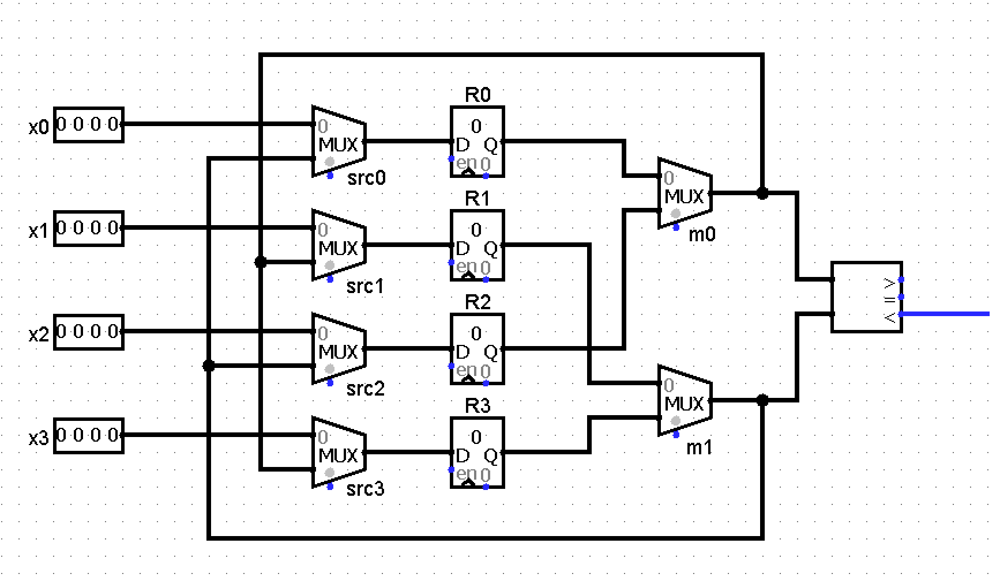
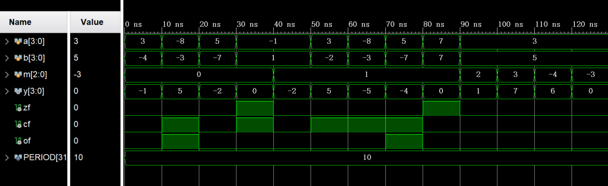
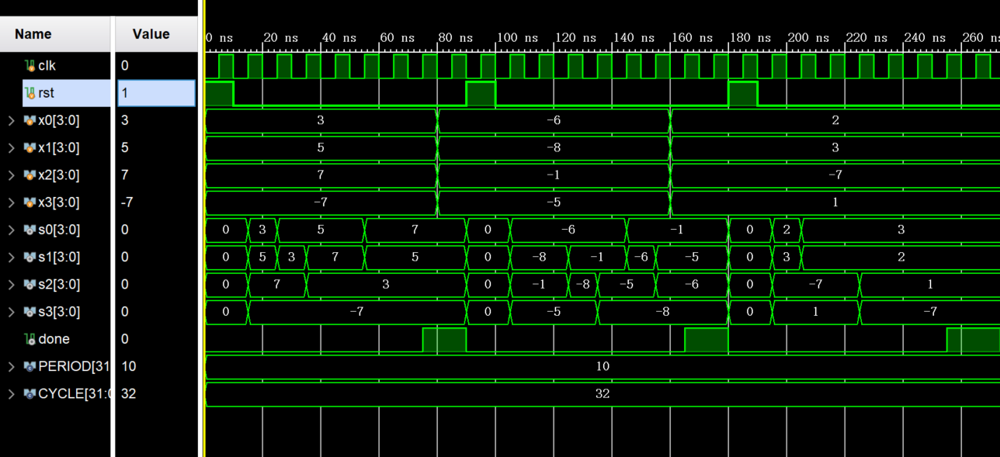

# 组成原理实验报告

###### Lab1	李平赫 PB18111770


## 逻辑设计

### 数据通路



其中比较器由ALU和它的标志位输出组合实现。

### 状态图和控制信号

使用冒泡排序的方式，需要比较6次：

R0~R1==>R1~R2==>R2~R3==>R0~R1==>R1~R2==>R0~R1 （“~”表示两个寄存器的值相比较，必要时交换）

加上读入数据和排序完成两个阶段，一共需要8个状态，在下表中列出。除了HALT的次态为自身，其余每个状态的次态均为表中下方的那个状态，复位后的初始状态为`LOAD`。

表中`en[0..3]`为4个寄存器的输入使能信号，`done`为排序完成标志，其余信号的意义在数据通路中已经标注。

`altb` = `sf`$\oplus$`of` 代表ALU端口`a`的值是否小于`b`（解释为有符号数）。

| State | src[0..3] | en[0..3]        | m[0..1] | done |
| ----- | --------- | --------------- | ------- | ---- |
| LOAD  | 0000      | 1111            | xx      | 0    |
| CX01  | 11xx      | altb,altb,0,0   | 00      | 0    |
| CX12  | x11x      | 0,!altb,!altb,0 | 10      | 0    |
| CX23  | xx11      | 0,0,altb,altb   | 11      | 0    |
| CX01S | 11xx      | altb,altb,0,0   | 00      | 0    |
| CX12S | x11x      | 0,!altb,!altb,0 | 10      | 0    |
| CX01T | 11xx      | altb,altb,0,0   | 00      | 0    |
| HALT  | xxxx      | 0000            | xx      | 1    |

为了简化电路，将`src[0..3]`中的无关项都设为1（这样就只需1bit信号），其它无关项均设为0。

| State | src[0..3] | en[0..3]        | m[0..1] | done |
| ----- | --------- | --------------- | ------- | ---- |
| LOAD  | 0000      | 1111            | 00      | 0    |
| CX01  | 1111      | altb,altb,0,0   | 00      | 0    |
| CX12  | 1111      | 0,!altb,!altb,0 | 10      | 0    |
| CX23  | 1111      | 0,0,altb,altb   | 11      | 0    |
| CX01S | 1111      | altb,altb,0,0   | 00      | 0    |
| CX12S | 1111      | 0,!altb,!altb,0 | 10      | 0    |
| CX01T | 1111      | altb,altb,0,0   | 00      | 0    |
| HALT  | 1111      | 0000            | 00      | 1    |


## 核心代码

### ALU

```verilog
    always @(*) begin
        cf = 0;
        case (m)
            `ADD : {cf,y} = a + b;
            `SUB : {cf,y} = a - b;
            `AND : y = a & b;
            `OR  : y = a | b;
            `XOR : y = a ^ b;
            default : y = 0;
        endcase
        case (m)
            `ADD : of = (~a[MSB]&~b[MSB]&y[MSB])|(a[MSB]&b[MSB]&~y[MSB]);
            `SUB : of = (~a[MSB]&b[MSB]&y[MSB])|(a[MSB]&~b[MSB]&~y[MSB]);
            default: of = 0;
        endcase
        case (m)
            `ADD, `SUB, `AND, `OR, `XOR: zf = ~|y;
            default: zf = 0;
        endcase
    end
```

### 排序（Data Path）

```verilog
    register #(N) R0(r0, i0, clk, rst, en0),
                  R1(r1, i1, clk, rst, en1),
                  R2(r2, i2, clk, rst, en2),
                  R3(r3, i3, clk, rst, en3);
    assign {s0,s1,s2,s3} = {r0,r1,r2,r3};

    alu #(N) ALU0(.y({sf,idle}), .of(of), .a(a), .b(b), .m(`SUB));
    assign altb = of ^ sf;
    
    mux2 #(N) MUX0(a, r0, r2, m0),
              MUX1(b, r1, r3, m1),
              RSRC0(i0, x0, b, rsrc),
              RSRC1(i1, x1, a, rsrc),
              RSRC2(i2, x2, b, rsrc),
              RSRC3(i3, x3, a, rsrc);
```

### 排序（Control Unit）

```verilog
    // state register
    reg [2:0] current_state, next_state;
    always @(posedge clk, posedge rst) begin
        if (rst) current_state <= `LOAD;
        else     current_state <= next_state;
    end
    
    // next state logic
    always @(*) begin
        case (current_state)
            `LOAD  : next_state = `CX01;
            `CX01  : next_state = `CX12;
            `CX12  : next_state = `CX23;
            `CX23  : next_state = `CX01S;
            `CX01S : next_state = `CX12S;
            `CX12S : next_state = `CX01T;
            `CX01T : next_state = `HALT;
            default: next_state = `HALT;
        endcase
    end
    
    // output logic
    always @(*) begin
        {rsrc,en0,en1,en2,en3,m0,m1,done} = 8'b10000000;
        case (current_state)
            `LOAD :
                begin rsrc = 0; {en0,en1,en2,en3} = 4'b1111; end
            `CX01, `CX01S, `CX01T :
                begin {en0,en1} = {2{altb}}; end
            `CX12, `CX12S :
                begin {en1,en2} = {2{~altb}}; m0 = 1; end
            `CX23 :
                begin {en2,en3} = {2{altb}}; m0 = 1; m1 = 1; end
            `HALT :
                done = 1;
        endcase
    end
```


## 仿真结果

### ALU



### 排序




## 思考题

1. 要调转顺序，只需要将控制信号中的所有`altb`与`!altb`互换

2. 使用两个ALU，三个周期即可完成排序部分：

   (R0~R1与R2~R3并行)==>(R0~R2与R1~R3并行)==>(R1~R2) 


## 实验总结

- 复习了硬件设计的开发流程
- 学习并体会了DataPath=>State/Control的设计模式，这对之后CPU的设计极为重要