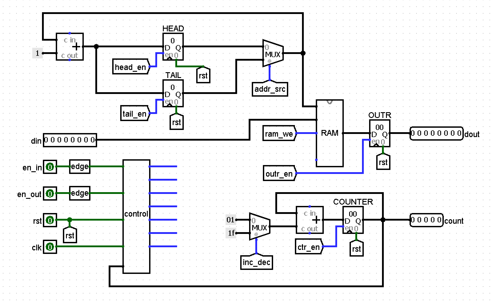
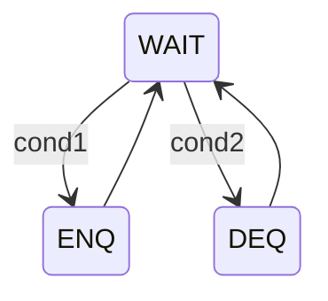
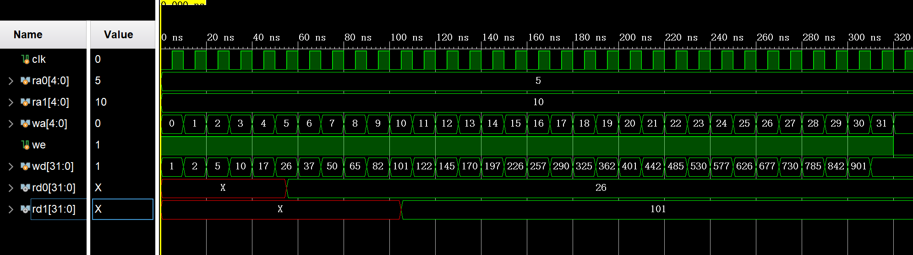
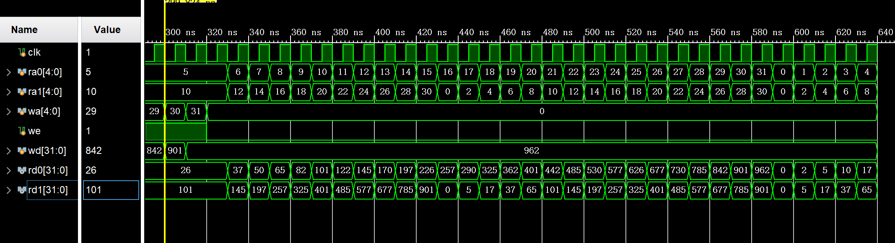
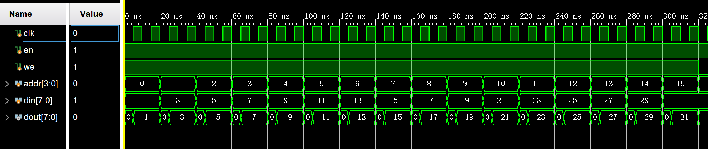
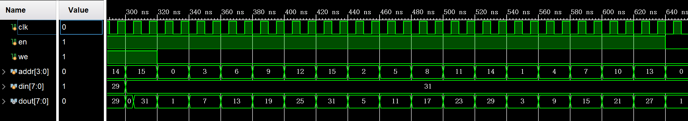
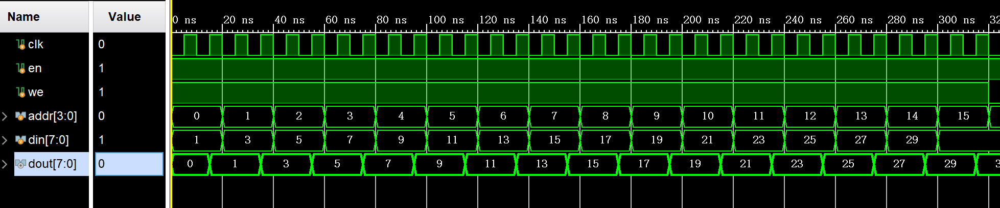
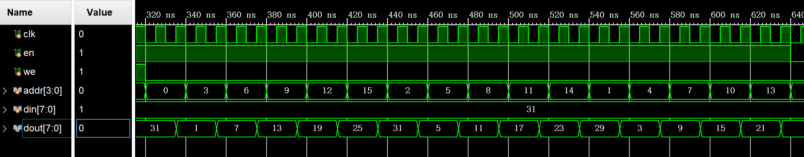
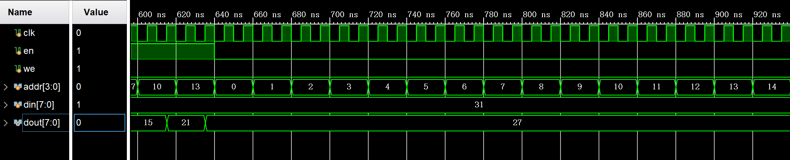
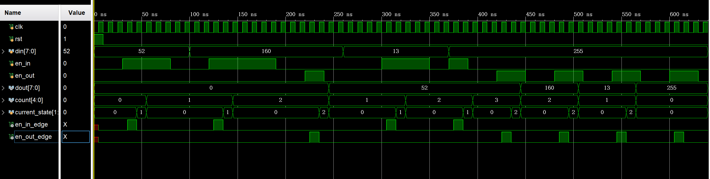

# <center>计算机组成原理 实验报告</center>

###### <center>姓名：李平赫； 学号：PB18111770； 实验日期：2020-4-29</center>


## 实验题目

Lab2：寄存器堆与队列


## 逻辑设计(FIFO)

#### 数据通路

设置4个寄存器

| 寄存器 | HEAD     | TAIL       | COUNTER        | OUTR     |
| ------ | -------- | ---------- | -------------- | -------- |
| 内容   | 队头地址 | 队尾地址+1 | 队列中元素数目 | 出队元素 |

由于希望每次入队（出队）操作时同时更新 `HEAD` （`TAIL`）和 `COUNTER` 两个寄存器，这里使用了两个加法器

图中 `edge` 表示取上升沿电路



#### 状态图



其中状态转移条件：

- cond1 = (en_in_edge==1) && (count<16)
- cond2 = (en_out_edge==1) && (count>0) && (~cond1)

也就是入队和出队信号同时有效时，忽略出队信号（但使用按钮控制入队和出队时，这种情况发生的概率极小）

#### 控制信号

| State | ram_we | head_en | tail_en | ctr_en | outr_en | addr_src | inc_dec |
| ----- | ------ | ------- | ------- | ------ | ------- | -------- | ------- |
| WAIT  | 0      | 0       | 0       | 0      | 0       | x        | x       |
| ENQ   | 1      | 0       | 1       | 1      | 0       | 1        | 0       |
| DEQ   | 0      | 1       | 0       | 1      | 1       | 0        | 1       |


## 核心代码

#### 寄存器堆

0号寄存器的值恒为零，需要特殊处理

```verilog
    reg [WIDTH-1:0] regs [1:31];
    // asynchronous read
    assign rd0 = ra0 ? regs[ra0] : 0;
    assign rd1 = ra1 ? regs[ra1] : 0;
    // synchronous write
    always @(posedge clk) begin
        if (we && wa) regs[wa] <= wd;
```

#### FIFO

##### 数据通路

```verilog
    // 取信号上升沿
    signal_edge IN_EDGE(clk, en_in, en_in_edge);
    signal_edge OUT_EDGE(clk, en_out, en_out_edge);
    // 分布式ram
    dist_mem_16x8 MEM(
        .clk(clk),
        .a(addr),
        .d(din),
        .spo(memout),
        .we(ram_we)
    );
    // OUTR只在出队时更新值，因此dout永远是上次出队的数据
    register #(8) OUTR(dout, memout, clk, rst, outr_en);
    // 队头队尾指针
    assign addr_inc = addr + 1;
    register #(4) HEAD(head_q, addr_inc, clk, rst, head_en);
    register #(4) TAIL(tail_q, addr_inc, clk, rst, tail_en);
    mux2 #(4) ADDRMUX(addr, head_q, tail_q, addr_src);
    // 队列数据计数
    assign ctr_d = ctr_q + addend;
    register #(5) COUNTER(ctr_q, ctr_d, clk, rst, ctr_en);
    mux2 #(5) CTRMUX(addend, 5'd1, -5'd1, inc_dec);
    assign count = ctr_q;
```

##### 控制单元

```verilog
    // state register
    reg [1:0] current_state, next_state;
    always @(posedge clk, posedge rst) begin
        if (rst)
            current_state <= WAIT;
        else
            current_state <= next_state;
    end
    
    // next state logic
    always @(*) begin
        case (current_state)
            WAIT : begin 
                if (en_in_edge && (ctr_q != 5'd16)) next_state = ENQ;
                else if (en_out_edge && (ctr_q != 5'd0)) next_state = DEQ;
                else next_state = WAIT;
            end
            ENQ, DEQ : next_state = WAIT;
            default : next_state = WAIT;
        endcase
    end
    
    // output logic
    always @(*) begin
        {ram_we, head_en, tail_en, ctr_en, outr_en, addr_src, inc_dec} = 7'b0;
        case (current_state)
            ENQ : {ram_we, tail_en, ctr_en, addr_src} = 4'b1111;
            DEQ : {head_en, ctr_en, outr_en, inc_dec} = 4'b1111;
        endcase
    end
```


## 仿真结果

#### 寄存器堆

##### 写时序



##### 读时序



#### RAM

##### distributed ram 写时序



addr改变时dout立即改变，但要等到时钟上升沿时dout才会更新为写入的数据，可见dram是“异步读，同步写”

##### distributed ram 读时序



##### block ram 写时序



addr和din准备好后的第二个时钟上升沿时dout才更新，可见bram是“同步写”，且应该需要延迟一个时钟周期

##### block ram 读时序



可见bram是“同步读”，且读操作会延迟一个时钟周期

##### block ram 不使能



en=0时，dout保持最后一次读出的数据不变

#### FIFO




## 实验总结

- 了解了 Vivado 中 Distributed Memory 和 Block Memory 的特性和区别，体会了通过实验（仿真波形）来学习新的IP核特性的方法
- 进一步熟悉了 DataPath=>Control 的设计开发模式