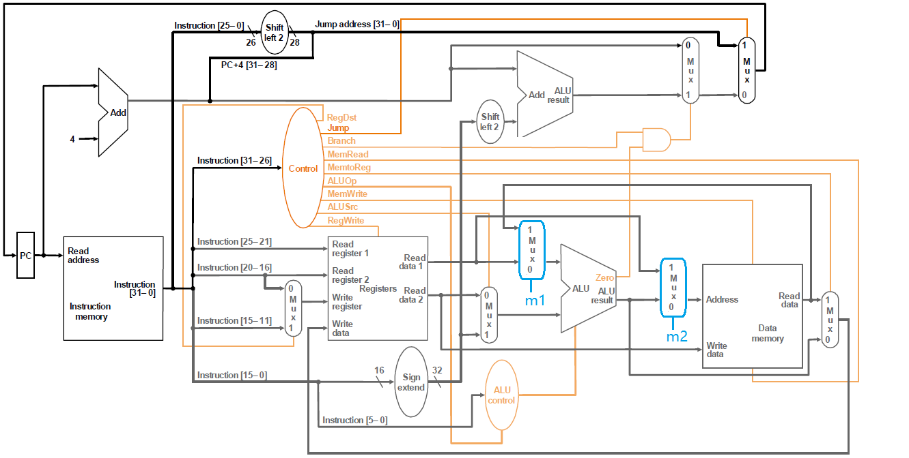

# <center>计算机组成原理 实验报告</center>

###### <center>姓名：李平赫； 学号：PB18111770； 实验日期：2020-5-6</center>


## 实验题目

Lab3：单周期CPU


## 逻辑设计(CPU)

#### 数据通路


#### 控制信号

单周期CPU只有一个状态——执行当前指令并更新PC，因此只需使用组合逻辑来实现控制单元。需要处理的是对于不同的 `opcode` (Instruction[31:26]) 发出不同的控制信号：（这里将数据通路图中Control与ALUControl合并在了一起，因此 `ALUOp` 有3位，直接作为ALU的输入；另外由于使用的dram IP核永远是读使能的，这里不需要 `MemRead` 信号）

| OpCode | Instr | Jump | Branch | MemWrite | RegWrite | RegDst | MemtoReg | ALUSrc  | ALUOp |
| ------ | ----- | ---- | ------ | -------- | -------- | ------ | -------- | ------- | ----- |
| 000000 | Rtype | 0    | 0      | 0        | 1        | 1 (rd) | 0        | 0 (rt)  | *     |
| 001000 | addi  | 0    | 0      | 0        | 1        | 0 (rt) | 0        | 1 (imm) | ADD   |
| 100011 | lw    | 0    | 0      | 0        | 1        | 0 (rt) | 1        | 1 (imm) | ADD   |
| 101011 | sw    | 0    | 0      | 1        | 0        | x      | x        | 1 (imm) | ADD   |
| 000100 | beq   | 0    | 1      | 0        | 0        | x      | x        | 0 (rt)  | XOR   |
| 000010 | j     | 1    | 0      | 0        | 0        | x      | x        | x       | xxx   |
| others |       | 0    | 0      | 0        | 0        | x      | x        | x       | xxx   |

*Rtype指令的 `ALUOp` 与 `funct` (Instruction[5:0]) 有关，在这里只实现add指令，因此可取 `ALUOp` = ( `funct` == 100000) ? ADD : xxx

实际代码中以上的 “x” 均用 “0” 填充


## 核心代码

#### CPU控制单元

```verilog
    reg Jump, Branch, MemWrite, RegWrite;
    reg RegDst, MemtoReg, ALUSrc;
    reg [2:0] ALUOp;
	always @(*) begin
        {Jump,Branch,MemWrite,RegWrite,RegDst,MemtoReg,ALUSrc,ALUOp} = 10'b0;
        case (inst[31:26])
            `RTYPE: begin
                {RegWrite,RegDst,MemtoReg,ALUSrc} = 4'b1100;
                case (inst[5:0])
                    `FUNC_ADD: ALUOp = `ALU_ADD;
                endcase
             end
            `ADDI : {{RegWrite,RegDst,MemtoReg,ALUSrc},ALUOp} = {4'b1001,`ALU_ADD};
            `LW   : {{RegWrite,RegDst,MemtoReg,ALUSrc},ALUOp} = {4'b1011,`ALU_ADD};
            `SW   : {{MemWrite,ALUSrc},ALUOp} = {2'b11,`ALU_ADD};
            `BEQ  : {{Branch,ALUSrc},ALUOp} = {2'b10,`ALU_XOR};
            `J    : Jump = 1'b1;
        endcase
    end
```

#### CPU数据通路

```verilog
    wire [31:0] nextpc, pc;
    register PC(.q(pc), .d(nextpc), .clk(clk), .rst(rst), .en(1));
    
    // Fetch
    dist_mem_gen_256x32 I_MEM(.spo(inst), .a(pc[31:2]), .clk(clk), .we(0));
    
    // Decode & WriteBack
    wire [4:0] wa;
    wire [31:0] rd0, rd1, wd;
    mux2 #(5) WA_MUX(.y(wa), .a(inst[20:16]), .b(inst[15:11]), .s(RegDst));
    register_file REGFILE(
        .rd0(rd0), .rd1(rd1), .wd(wd),
        .ra0(inst[25:21]), .ra1(inst[20:16]), .wa(wa),
        .clk(clk), .we(RegWrite)
    );
    
    wire [31:0] addrext;
    signext ADDR_EXT(.dout(addrext), .din(inst[15:0]));
    
    // Execute
    wire [31:0] aluout, alub;
    wire Zero;
    mux2 ALUb_MUX(.y(alub), .a(rd1), .b(addrext), .s(ALUSrc));
    alu ALU(.y(aluout), .zf(Zero), .a(rd0), .b(alub), .m(ALUOp));
    
    // Memory
    wire [31:0] memout;
    dist_dmem_gen_256x32 D_MEM(.spo(memout), .a(aluout[31:2]), .d(rd1), .clk(clk), .we(MemWrite));
    mux2 WD_MUX(.y(wd), .a(aluout), .b(memout), .s(MemtoReg));
    
    // NextPC
    wire [31:0] pc_add_4, br_target, j_target, temppc;
    assign pc_add_4 = pc + 4;
    assign br_target = pc_add_4 + {addrext[29:0],2'b00};
    assign j_target = {pc_add_4[31:28], inst[25:0], 2'b00};
    mux2 BR_MUX(.y(temppc), .a(pc_add_4), .b(br_target), .s(Branch&Zero));
    mux2 J_MUX(.y(nextpc), .a(temppc), .b(j_target), .s(Jump));
```

#### 增加了调试接口的CPU

```verilog
module cpu_one_cycle_db(
    input clk, rst,
    input run,
    input [29:0] m_rf_addr,
    output [31:0] m_data, rf_data,
    output [233:0] status
    );
    ...
endmodule
```

这里有几点调整：

- 为了实现单步执行的功能，该CPU需要处理来自DBU的 `run` 信号。而单周期CPU只有三处会更新状态：PC、寄存器堆与RAM，因此将这三处时序部件的（原来的）使能信号与 `run` 相与即可
- 寄存器堆与RAM都多了一个读端口，输入地址为 `m_rf_addr` ，输出数据分别为 `rf_data` 和 `m_data` 
- CPU的各种内部信号合并为 `status` 输出

#### DBU

```verilog
module dbu(
    input clk, rst,
    input succ, step,
    input [2:0] sel,
    input m_rf, inc, dec,
    output [15:0] led,
    output [7:0] an,
    output [7:0] seg
    );
    
    wire run;                   // 控制CPU的运行
    reg [7:0] m_rf_addr;        // MEM/RF的调试读口地址(字地址)
    wire [233:0] status;        // CPU内部状态(使用文件开头定义的宏来分离对应信号)
    wire [31:0] m_data, rf_data;// 从RF/MEM读取的数据字
    
    cpu_one_cycle_db CPU(
        .clk(clk), .rst(rst),
        .run(run), .status(status),
        .m_rf_addr(m_rf_addr),
        .m_data(m_data), .rf_data(rf_data)
    );
    
    // 与按钮相连的信号需要取边沿
    wire step_edge, inc_edge, dec_edge;
    signal_edge STEPEDGE(clk, step, step_edge);
    signal_edge INCEDGE(clk, inc, inc_edge);
    signal_edge DECEDGE(clk, dec, dec_edge);
    
    assign run = succ | step_edge;
    
    always @(posedge clk, posedge rst) begin
        if (rst) m_rf_addr <= 0;
        else begin
            if (inc_edge) m_rf_addr <= m_rf_addr + 1;
            else if(dec_edge) m_rf_addr <= m_rf_addr - 1;
        end
    end
    
    assign led = sel ? status[`CTRL] : m_rf_addr;
    
    reg [31:0] seg_num;         // 8个数码管上显示的数字
    always @(*) begin
        case (sel)
            3'd0: seg_num = m_rf ? m_data : rf_data;
            3'd1: seg_num = status[`PC_IN];
            3'd2: seg_num = status[`PC_OUT];
            3'd3: seg_num = status[`INSTR];
            3'd4: seg_num = status[`RF_RD1];
            3'd5: seg_num = status[`RF_RD2];
            3'd6: seg_num = status[`ALU_Y];
            3'd7: seg_num = status[`M_RD];
        endcase
    end
    
    //将要显示的数字转换为数码管的控制信号
    seg_display SEGDISP(
        .clk(clk),
        .seg_en(8'hff),
        .num(seg_num),
        .ca(seg),
        .an(an)
    );
endmodule
```


## 仿真结果

#### CPU


#### DBU

##### 单步执行与功能选择


##### 连续执行


##### 查看RAM


仿真中出现了“X”，这是因为寄存器堆没有初始化功能，未被赋值的寄存器内容不确定（实际电路中总会是某一个值）


## 思考题

修改数据通路和控制器，增加支持如下指令：

accm: rd <- M(rs) + rt;      op = 000000, funct = 101000

只需在数据通路中添加两个选择器



选择器的控制信号 `m1` 和 `m2` 相同，原控制信号表添加一列

| OpCode | Instr | Jump | Branch | MemW | RegW | RegDst | MtoReg | ALUSrc  | ALUOp | m1(=m2) |
| ------ | ----- | ---- | ------ | ---- | ---- | ------ | ------ | ------- | ----- | ------- |
| 000000 | Rtype | 0    | 0      | 0    | 1    | 1 (rd) | 0      | 0 (rt)  | *     | *       |
| 001000 | addi  | 0    | 0      | 0    | 1    | 0 (rt) | 0      | 1 (imm) | ADD   | 0       |
| 100011 | lw    | 0    | 0      | 0    | 1    | 0 (rt) | 1      | 1 (imm) | ADD   | 0       |
| 101011 | sw    | 0    | 0      | 1    | 0    | x      | x      | 1 (imm) | ADD   | 0       |
| 000100 | beq   | 0    | 1      | 0    | 0    | x      | x      | 0 (rt)  | XOR   | 0       |
| 000010 | j     | 1    | 0      | 0    | 0    | x      | x      | x       | xxx   | x       |
| others |       | 0    | 0      | 0    | 0    | x      | x      | x       | xxx   | x       |

*其中Rtype指令的 `ALUOp` 、 `m1` 与 `funct` 有关，在这里只实现add和accm指令

| func   | Instr | ALUOp | m1(=m2) |
| ------ | ----- | ----- | ------- |
| 100000 | add   | ADD   | 0       |
| 101000 | accm  | ADD   | 1       |
| others |       | xxx   | x       |


## 实验总结

单周期CPU的一个特点是，它的控制器是“无状态”的，每个周期都做完全相同的事——根据当前指令给出控制信号。我们设计的CPU内只有三处时序逻辑器件——PC、寄存器堆、RAM（换句话说，这三处的状态完全决定了CPU的状态），因此电路设计比较简单，重点关注好控制信号就行了（在只考虑正确性的前提下）。


## 意见/建议

DBU存在的意义就是在开发板上调试CPU，很多信号与硬件紧耦合（比如按钮信号需要去抖动，数码管控制信号需要时分复用，这些功能不容易使用仿真测试），个人认为用仿真调试DBU的意义不大

