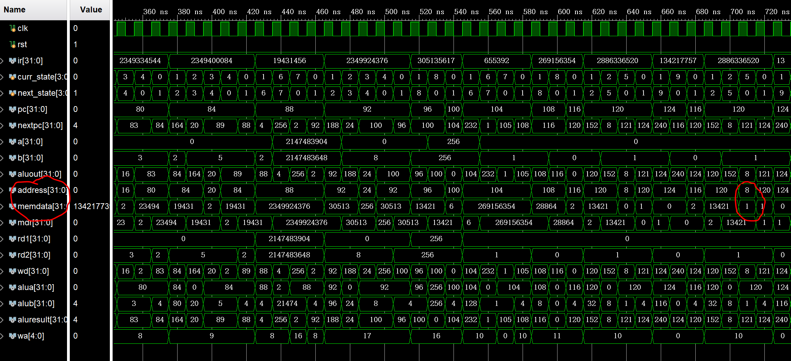

# <center>计算机组成原理 实验报告</center>

###### <center>姓名：李平赫； 学号：PB18111770； 实验日期：2020-5-13</center>


## 实验题目

Lab4：多周期CPU


## 逻辑设计(CPU)

#### 数据通路


#### 状态图


#### 控制信号

| STATE   | PCwe | IorD | MemWrite | MemtoReg | IRWrite | RegDst | RegWrite | ALUSrcA | ALUSrcB | PCSource | ALUm |
| ------- | ---- | ---- | -------- | -------- | ------- | ------ | -------- | ------- | ------- | -------- | ---- |
| IF      | 1    | 0    |          |          | 1       |        |          | 0       | 01      | 00       | add  |
| DE      |      |      |          |          |         |        |          | 0       | 11      |          | add  |
| LWSW_EX |      |      |          |          |         |        |          | 1       | 10      |          | add  |
| LW_MEM  |      | 1    |          |          |         |        |          |         |         |          |      |
| LW_WB   |      |      |          | 1        |         | 0      | 1        |         |         |          |      |
| SW_MEM  |      | 1    | 1        |          |         |        |          |         |         |          |      |
| RT_EX   |      |      |          |          |         |        |          | 1       | 00      |          | *    |
| RT_WB   |      |      |          | 0        |         | 1      | 1        |         |         |          |      |
| BEQ_EX  | Zero |      |          |          |         |        |          | 1       | 00      | 01       | xor  |
| J_EX    | 1    |      |          |          |         |        |          |         |         | 10       |      |
| ADDI_EX |      |      |          |          |         |        |          | 1       | 10      |          | add  |
| ADDI_WB |      |      |          | 0        |         | 0      | 1        |         |         |          |      |

这里只填写了每个状态实现相应功能需要的控制信号，不过需要注意 `PCwe` , `MemWrite` , `IRWrite` , `RegWrite` 这四个信号是寄存器/内存更新的使能信号，在不用时必须设为 `0` ，否则可能会导致意料外的状态变化，其余的信号不用时为无关项 `x` 

状态为 RT_EX 时，`ALUm` 的值为 `*` ，代表需要根据当前指令的 FUNCT 决定

编写 Verilog 代码时，不妨将上表中空白除均填写为 `0` ，这样在不同状态时只需特殊处理含有 `1` 的项


## 核心代码

#### CPU控制单元

```verilog
    // State Register
    reg [3:0] curr_state, next_state;
    always @(posedge clk, posedge rst) begin
        if (rst) curr_state <= `IF;
        else curr_state <= next_state;
    end

    // Next State Logic
    always @(*) begin
        case (curr_state)
            `IF     : next_state = `DE;
            `DE     : 
                begin
                    case (ir[31:26])
                        `RTYPE : next_state = `RT_EX;
                        `ADDI  : next_state = `ADDI_EX;
                        `LW    : next_state = `LWSW_EX;
                        `SW    : next_state = `LWSW_EX;
                        `BEQ   : next_state = `BEQ_EX;
                        `J     : next_state = `J_EX;
                        default: next_state = `IF;
                    endcase
                end
            `LWSW_EX: next_state = (ir[31:26] == `LW) ? `LW_MEM : `SW_MEM;
            `LW_MEM : next_state = `LW_WB;
            `LW_WB  : next_state = `IF;
            `SW_MEM : next_state = `IF;
            `RT_EX  : next_state = `RT_WB;
            `RT_WB  : next_state = `IF;
            `BEQ_EX : next_state = `IF;
            `J_EX   : next_state = `IF;
            `ADDI_EX: next_state = `ADDI_WB;
            `ADDI_WB: next_state = `IF;
            default : next_state = `IF;
        endcase
    end

    // Output Logic
    always @(*) begin
        {PCwe, IorD, MemWrite, MemtoReg, IRWrite, RegDst,
        RegWrite, ALUSrcA, ALUSrcB, PCSource, ALUm} = 15'b0;
        case (curr_state)
            `IF     : {PCwe, IRWrite, ALUSrcB, ALUm} = {4'b1101, `ALU_ADD};
            `DE     : {ALUSrcB, ALUm} = {2'b11, `ALU_ADD};
            `LWSW_EX: {ALUSrcA, ALUSrcB, ALUm} = {3'b110, `ALU_ADD};
            `LW_MEM : {IorD} = 1'b1;
            `LW_WB  : {MemtoReg, RegWrite} = 2'b11;
            `SW_MEM : {IorD, MemWrite} = 2'b11;
            `RT_EX  : 
                begin
                    // 按实验要求ALU Control合并到了整个Control Unit
                    ALUSrcA = 1'b1;
                    case (ir[5:0])
                        `FUNCT_ADD: ALUm = `ALU_ADD;
                        `FUNCT_SUB: ALUm = `ALU_SUB;
                        `FUNCT_AND: ALUm = `ALU_AND;
                        `FUNCT_OR : ALUm = `ALU_OR;
                        `FUNCT_XOR: ALUm = `ALU_XOR;
                    endcase
                end
            `RT_WB  : {RegDst, RegWrite} = 2'b11;
            `BEQ_EX : {PCwe, ALUSrcA, PCSource, ALUm} = {Zero, 3'b101, `ALU_XOR};
            `J_EX   : {PCwe, PCSource} = 3'b110;
            `ADDI_EX: {ALUSrcA, ALUSrcB, ALUm} = {3'b110, `ALU_ADD};
            `ADDI_WB: {RegWrite} = 1'b1;
        endcase
    end
```

#### CPU数据通路

```verilog
    // 多周期CPU中很多部件是复用的，很难说某个部件就是实现某个功能，因此这里不方便加注释
	assign jumpaddr = {pc[31:28], ir[25:0], 2'b00};
    mux4 PC_MUX(.y(nextpc), .x0(aluresult), .x1(aluout), .x2(jumpaddr), .s(PCSource));
    register PC(.q(pc), .d(nextpc), .clk(clk), .rst(rst), .en(PCwe));
    
    mux2 ADDR_MUX(.y(address), .x0(pc), .x1(aluout), .s(IorD));
    dist_mem_gen_512x32 MEM(
        .a(address[31:2]),
        .d(b),
        .spo(memdata),
        .clk(clk),
        .we(MemWrite)
    );
    register IR(.q(ir), .d(memdata), .clk(clk), .rst(rst), .en(IRWrite));
    register MDR(.q(mdr), .d(memdata), .clk(clk), .rst(rst), .en(1'b1));
    
    mux2 #(5) WA_MUX(.y(wa), .x0(ir[20:16]), .x1(ir[15:11]), .s(RegDst));
    mux2 WD_MUX(.y(wd), .x0(aluout), .x1(mdr), .s(MemtoReg));
    register_file REGFILE(
        .rd1(rd1), .rd2(rd2), .wd(wd),
        .ra1(ir[25:21]), .ra2(ir[20:16]), .wa(wa),
        .clk(clk), .we(RegWrite)
    );
    register A(.q(a), .d(rd1), .clk(clk), .rst(rst), .en(1'b1));
    register B(.q(b), .d(rd2), .clk(clk), .rst(rst), .en(1'b1));
    
    signext SEXT(.dout(addrext), .din(ir[15:0]));
    mux2 ALUA_MUX(.y(alua), .x0(pc), .x1(a), .s(ALUSrcA));
    mux4 ALUB_MUX(.y(alub), .x0(b), .x1(32'd4), .x2(addrext), .x3({addrext[29:0],2'b00}), .s(ALUSrcB));
    alu ALU(.y(aluresult), .zf(Zero), .a(alua), .b(alub), .m(ALUm));
    register ALUOUT(.q(aluout), .d(aluresult), .clk(clk), .rst(rst), .en(1'b1));
```

#### 增加了调试接口的CPU

```verilog
module cpu_multicycle_db(
    input clk,
    input rst,
    input [7:0] m_rf_addr,
    output [31:0] m_data, rf_data,
    output [207:0] status
    );
    ...
endmodule
```

这里有几点调整：

- 寄存器堆与RAM都多了一个读端口，输入地址为 `m_rf_addr` ，输出数据分别为 `rf_data` 和 `m_data` 
- CPU的各种内部信号合并为 `status` 输出

#### DBU

与Lab3中实现的DBU只有以下区别：

- 原来的 `run = succ | step_edge` 调整为现在的 `clkd = (succ | step_edge) & clk` ，`clkd` 直接作为CPU的时钟信号
-  `sel = 1 ~ 7` 时数码管显示的内容做相应更改，LED显示内容刚好对应15位控制信号和 `ALUZero` 


## 仿真结果

#### CPU



最后MEM[8]的值为1，且PC在116,120和124间反复跳转，可见通过了测试代码

#### DBU

##### 单步(状态)执行与功能选择


每一次 `step` 上升沿来临后，可以通过倒数第二行的 `curr_state` 检查状态转移

##### 连续执行


这时相当于 `clk` 直接作为 `clkd` 传入CPU

##### 查看RAM


仿真中出现了“X”，这是因为寄存器堆没有初始化功能，未被赋值的寄存器内容不确定（实际电路中总会是某一个值）


## 思考题

这里实现了 SUB，AND，OR，XOR。由于他们都是R-Type指令，数据通路与状态图不需要改变，只需要在RT_EX状态时根据指令的FUNCT给出不同的 `ALUm` ，前面给出的代码已经实现了这一点。


## 实验总结

多周期CPU最重要的一点就是它的状态图，控制信号是随状态改变而不是随指令改变，因此控制单元的设计需要花些功夫。而多周期CPU另一特色就是许多原件可以复用（比如一个指令周期内多次使用了ALU，这取代了单周期CPU中的许多加法器），理论上面积应该可以比单周期CPU小（实现同等功能的情况下）。
