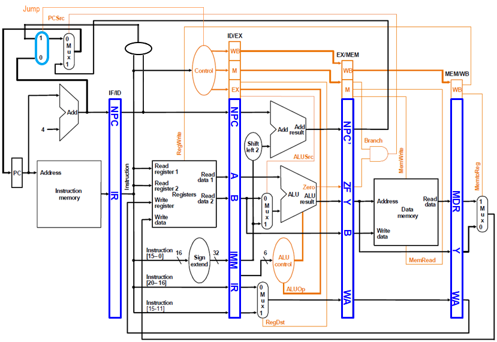
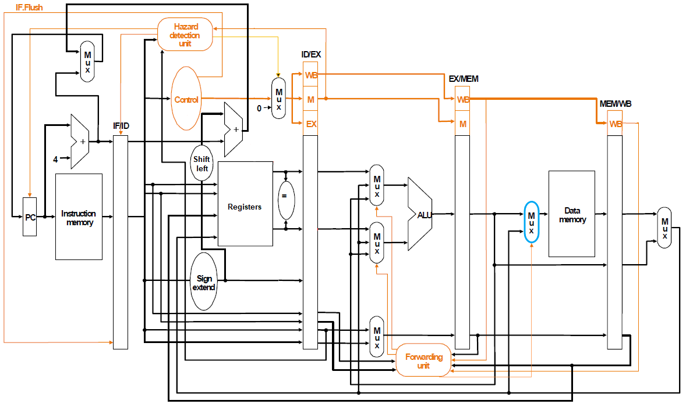
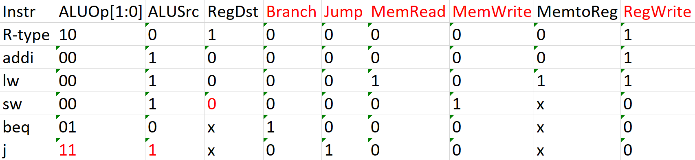
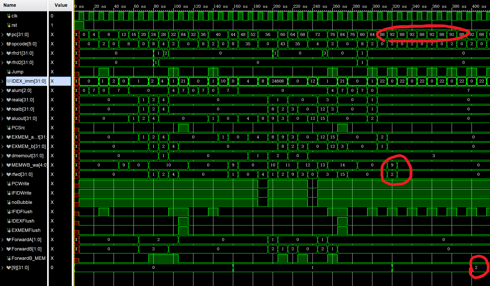

# <center>计算机组成原理 实验报告</center>

###### <center>姓名：李平赫； 学号：PB18111770； 实验日期：2020-5-27</center>


## 实验题目

Lab5：流水线 CPU


## 逻辑设计

### 数据通路

##### 增加了 `j` 指令的数据通路（蓝色选择器以及相关数据通路）：



##### 增加了 WB 到 MEM 段的转发（蓝色选择器以及相关数据通路）：

PS：与图中不同，我的设计中 `beq` 指令依然是在 MEM 段完成




### 控制信号



其中标红的控制信号意味着在不需要用到时必须设为 `0` （它们通常涉及到改变 CPU 内部状态）

`sw` 指令的 `RegDst` 设为 `0` ，是为了使指令中的 Rt 字段存到 EX/MEM.WA 中，从而判断是否需要转发

`j` 指令的 `ALUSrc` 设为 `1` ，是为了避免在 ID 段判断为 load-use 数据相关从而使流水线互锁


## 核心代码

#### 控制单元

```verilog
module control(
    input [5:0] opcode,
    output reg [1:0] ALUOp,
    output reg ALUSrc, RegDst, Branch, Jump, MemRead, MemWrite, MemtoReg, RegWrite
    );
    always @(*) begin
        {ALUOp,ALUSrc,RegDst,Branch,Jump,MemRead,MemWrite,MemtoReg,RegWrite} = 10'b0;
        case (opcode)
            `RTYPE: {ALUOp[1],RegDst,RegWrite} = 3'b111;
            `ADDI : {ALUSrc,RegWrite} = 2'b11;
            `LW   : {ALUSrc,MemRead,MemtoReg,RegWrite} = 4'b1111;
            `SW   : {ALUSrc,MemWrite} = 2'b11;
            `BEQ  : {ALUOp[0],Branch} = 2'b11;
            `J    : {ALUOp,ALUSrc,Jump} = 4'b1111;
        endcase
    end
endmodule
```

#### 转发单元

```verilog
module forward(
    output reg [1:0] ForwardA, ForwardB,
    output reg ForwardB_MEM,
    input [4:0] IDEX_rs, IDEX_rt, EXMEM_wa, MEMWB_wa,
    input EXMEM_RegWrite, MEMWB_RegWrite
    );
    always @(*) begin
        ForwardA = 2'b00;
        ForwardB = 2'b00;
        ForwardB_MEM = 1'b0;
        if (MEMWB_RegWrite && (MEMWB_wa != 5'b0)) begin
            if (MEMWB_wa == IDEX_rs) ForwardA = 2'b01;
            if (MEMWB_wa == IDEX_rt) ForwardB = 2'b01;
            if (MEMWB_wa == EXMEM_wa) ForwardB_MEM = 1'b1;
        end
        if (EXMEM_RegWrite && (EXMEM_wa != 5'b0)) begin
            if (EXMEM_wa == IDEX_rs) ForwardA = 2'b10;
            if (EXMEM_wa == IDEX_rt) ForwardB = 2'b10;
        end
    end
endmodule
```

#### 冒险检测单元

```verilog
module hazard(
    output reg PCWrite, IFIDWrite, noBubble, IFIDFlush, IDEXFlush, EXMEMFlush,
    input [4:0] IFID_rs, IFID_rt, IDEX_rt,
    input IDEX_MemRead, ExUseRs, ExUseRt, Jump, Brtaken
    );
    always @(*) begin
        {PCWrite,IFIDWrite,noBubble} = 3'b111;
        // 检测 load-use 数据相关
        if (IDEX_MemRead && (IDEX_rt != 5'b0) && (
                ((IDEX_rt == IFID_rs) && ExUseRs) || 
                ((IDEX_rt == IFID_rt) && ExUseRt)
            )
        ) begin
            {PCWrite,IFIDWrite,noBubble} = 3'b000;
        end
    end
    always @(*) begin
        {IFIDFlush,IDEXFlush,EXMEMFlush} = 3'b000;
        // 检测 jump 控制相关
        if (Jump) IFIDFlush = 1'b1;
        // 处理分支预测失败
        if (Brtaken) {IFIDFlush,IDEXFlush,EXMEMFlush} = 3'b111;
    end
endmodule
```

#### 部分数据通路

只列出了控制信号的段间寄存器，完整代码见附件

```verilog
    register #(9) IDEX_CTRL(
        .q({IDEX_ALUOp,IDEX_ALUSrc,IDEX_RegDst,IDEX_Branch,
            IDEX_MemRead,IDEX_MemWrite,IDEX_MemtoReg,IDEX_RegWrite}),
        .d(noBubble ? {ALUOp,ALUSrc,RegDst,Branch,
                       MemRead,MemWrite,MemtoReg,RegWrite} : 9'b0),
        .clk(clk), .rst(rst || IDEXFlush), .en(1'b1)
    );
    register #(5) EXMEM_CTRL(
        .q({EXMEM_Branch,EXMEM_MemRead,EXMEM_MemWrite,
            EXMEM_MemtoReg,EXMEM_RegWrite}),
        .d({IDEX_Branch,IDEX_MemRead,IDEX_MemWrite,
            IDEX_MemtoReg,IDEX_RegWrite}),
        .clk(clk), .rst(rst || EXMEMFlush), .en(1'b1)
    );
    register #(2) MEMWB_CTRL(
        .q({MEMWB_MemtoReg,MEMWB_RegWrite}),
        .d({EXMEM_MemtoReg,EXMEM_RegWrite}),
        .clk(clk), .rst(rst), .en(1'b1)
```


## 仿真结果

这里使用了助教提供的第二个测试样例



可以看到最后 $t1 (9号) 寄存器的值为 2 ，而 PC 维持在 88（十进制），即指令

```assembly
_success:
    j _success
```

说明结果正确。

PS：最后 PC 在 88 与 92 之间来回跳转是因为每个时钟上升沿 PC 的值都会更新（除非检测到 load-use 相关需要互锁），而 `j` 指令需要在它的第二个周期才能完成（更新 PC 为88），在那之前会有一次 PC+4.


## 思考题

我的 CPU 设计中，如果遇到 `beq` 指令，流水线不会暂停，而是接着从 PC+4 取址。待 `beq` 到达 MEM 段，如果发现不需要跳转，就什么也不用做；如果需要跳转，就更新 PC 同时清空 IF/ID, ID/EX, EX/MEM 三个段间寄存器的内容（实际上清空相应的控制信号即可），使得之后的三条（不应该执行的）指令不会更改程序员可见状态（通用寄存器、内存）。

这样做，其实就是实现了静态分支预测（always not taken），预测失败的惩罚为 3 个时钟周期。


## 实验总结

通过这次实验充分理解了流水线 CPU 的设计，特别是段间寄存器的使用，通过转发和互锁解决数据相关，通过互锁和分支预测解决控制相关。与单周期/多周期这种（一个时刻只有一条指令在执行的）顺序模型实现不同，流水线实现需要充分考虑各种指令序列可能带来的问题，使得 CPU 的设计复杂许多，因此这是一次很好的实践经验。

