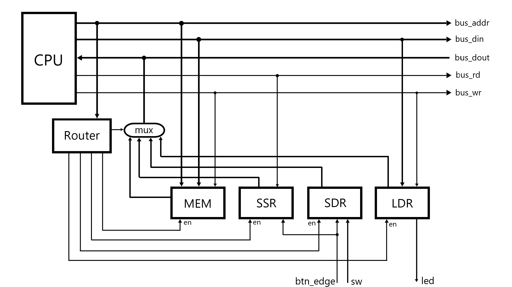
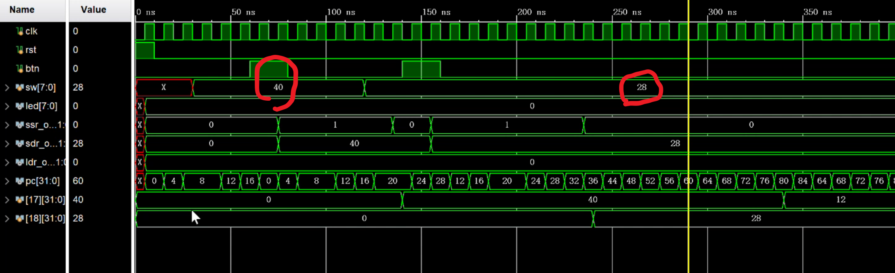
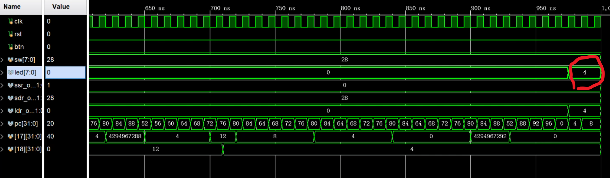
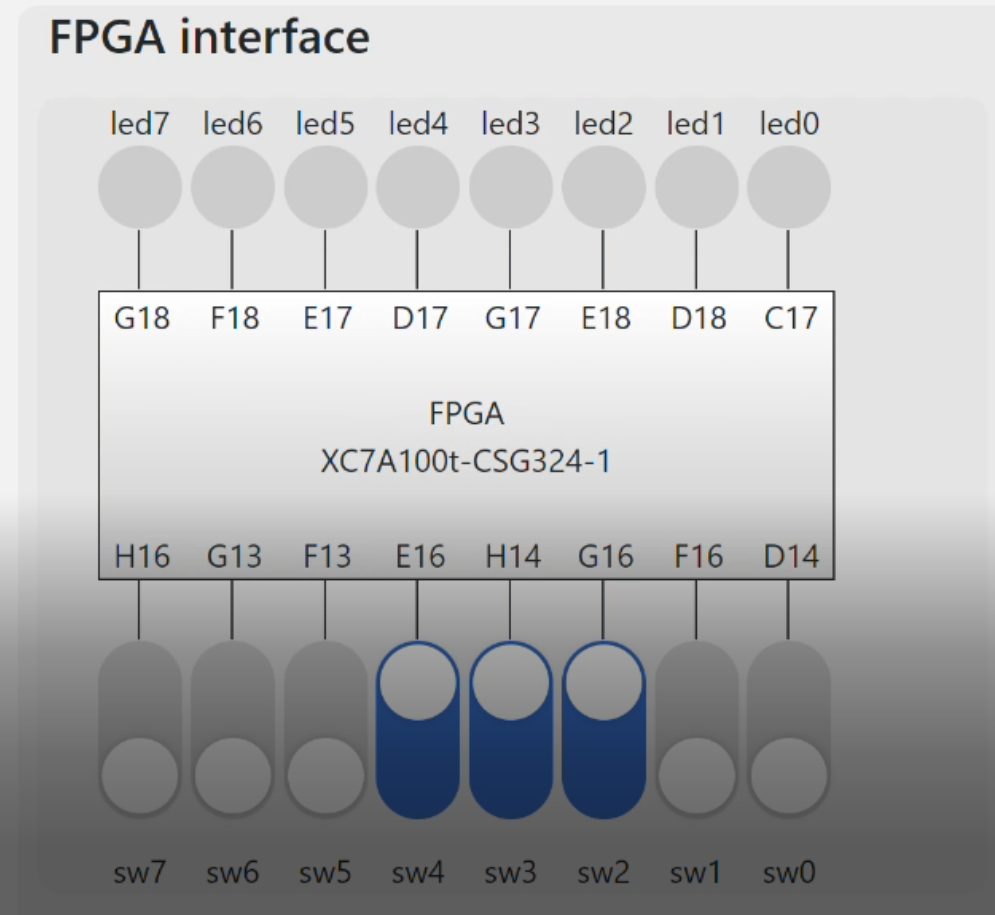
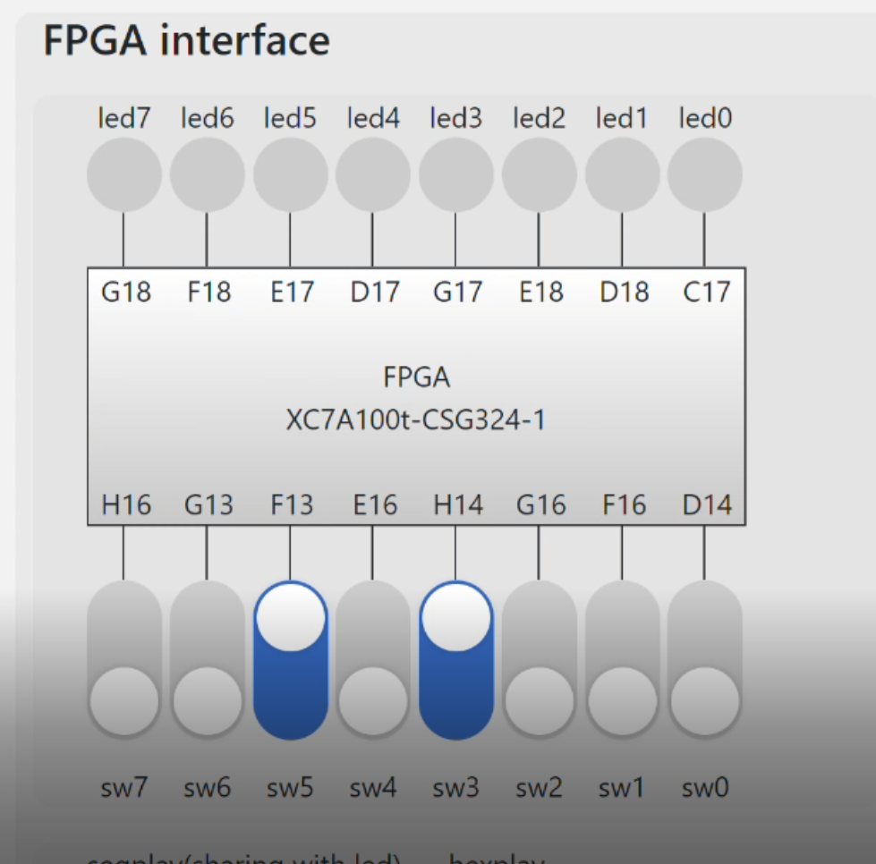
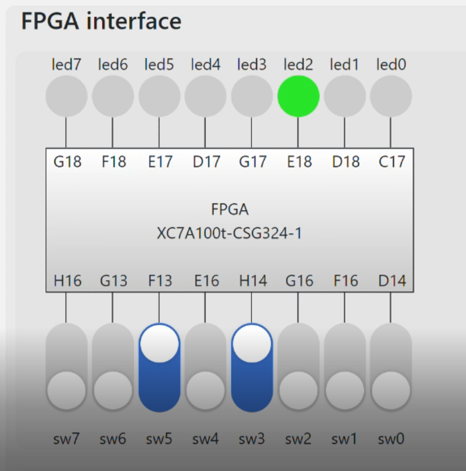

# <center>计算机组成原理 实验报告</center>

###### <center>姓名：李平赫； 学号：PB18111770； 实验日期：2020-6-17</center>


## 实验题目

Lab6：综合设计


## 逻辑设计

#### 应用功能

输入两个整数，输出其最大公因数。选用Lab5设计的流水线CPU，增加 `slt` 指令

#### I/O接口

输入设备：板载开关，通过按钮和SSR（switch state register）、SDR（switch data register）控制。开关拨动至需要输入的值后，按下按钮，将开关的值存至SDR，同时将SSR至为1，表示有数据可读；CPU读取SDR的值后SSR自动复位成0

输出设备：板载LED，通过LDR（led data register）控制。CPU直接将需要输出的值存至LDR

三个I/O控制寄存器的读写通过 `lw` 和 `sw` 指令完成，内存映射关系如下：

| 内容                  | 地址（高16位均为0） |
| --------------------- | ------------------- |
| instruction           | 0x0000 ~ 0x03FF     |
| data                  | 0x1000 ~ 0x13FF     |
| switch state register | 0x2000 ~ 0x2003     |
| switch data register  | 0x2004 ~ 0x2007     |
| led data register     | 0x200C ~ 0x200F     |

#### 数据通路

Router的作用是根据请求的地址使相应的存储设备有效（根据上表的映射关系）

简单起见，我只将数据存储器挂载到总线上，指令存储器依然集成在CPU内部




## 核心代码

#### 总线与外设

```verilog
module bus(
    input clk, rst,
    input btn,
    input [7:0] sw,
    output [7:0] led
    );
    wire [31:0] bus_addr;
    wire [31:0] bus_din;
    wire [31:0] bus_dout;
    wire bus_rd, bus_wr;
    
    // CPU
    cpu_top CPU(
        .clk(clk), .rst(rst),
        .bus_addr(bus_addr),
        .bus_din (bus_din ),
        .bus_dout(bus_dout),
        .bus_rd  (bus_rd  ),
        .bus_wr  (bus_wr  )
     );
     
    // ssr: switch state register
    // sdr: switch data register
    // ldr: led data register
    reg  mem_en, ssr_en, sdr_en, ldr_en;
    wire [31:0] mem_out, ssr_out, sdr_out, ldr_out;
    
    // Memory
    dmem_256x32 DMEM(
        .a(bus_addr[9:2]), .d(bus_din),
        .clk(clk), .we(mem_en & bus_wr), .spo(mem_out)
    );
    
    // IO Interface
    
    // Switch
    wire btn_edge;
    signal_edge EDGE(.clk(clk), .button(btn), .button_redge(btn_edge));
    register SSR(.q(ssr_out), .d(32'b1), .clk(clk), .rst((sdr_en & bus_rd) | rst), .en(btn_edge));
    register SDR(.q(sdr_out), .d({24'b0,sw}), .clk(clk), .rst(rst), .en(btn_edge));
    
    // LED
    register LDR(.q(ldr_out), .d(bus_din), .clk(clk), .rst(rst), .en(ldr_en & bus_wr));
    assign led = ldr_out[7:0];
    
    // Bus Router  
    assign bus_dout = ({32{mem_en}} & mem_out)
                    | ({32{ssr_en}} & ssr_out)
                    | ({32{sdr_en}} & sdr_out)
                    | ({32{ldr_en}} & ldr_out);
                  
    always @(*) begin
        {mem_en, ssr_en, sdr_en, ldr_en} = 4'b0;
        if (bus_addr[13] == 0)     // memory
            mem_en = 1;
        else case(bus_addr[3:2])   // IO
            2'b00: ssr_en = 1;
            2'b01: sdr_en = 1;
            2'b11: ldr_en = 1;
        endcase
    end
endmodule
```

#### I/O操作

```assembly
input:	# 输入值存入$s1
	lw	$t0, 0x2000($zero)
	beq	$t0, $zero, input
	lw	$s1, 0x2004($zero)
```

```assembly
output:	# 输出$s1的值
	sw	$s1, 0x200c($zero)
```

#### 应用程序

```assembly
.text
input1:
	lw	$t0, 0x2000($zero)	#0
	beq	$t0, $zero, input1	#4
	lw	$s1, 0x2004($zero)	#8
input2:
	lw	$t0, 0x2000($zero)	#12
	beq	$t0, $zero, input2	#16
	lw	$s2, 0x2004($zero)	#20
check:
	beq	$s1, $zero, end		#24
	beq	$s2, $zero, s2zero	#28
	j	begin				#32
s2zero:
	add	$s2, $s1, $zero		#36
	j	end					#40
begin:
	slt	$t0, $s1, $s2		#44
	beq	$t0, $zero, mod		#48
switch:
	add	$t1, $s1, $zero		#52
	add	$s1, $s2, $zero		#56
	add	$s2, $t1, $zero		#60
mod:
	sub	$s1, $s1, $s2		#64
	slt	$t0, $s1, $zero		#68
	beq	$t0, $zero, mod		#72
	add	$s1, $s1, $s2		#76
	beq	$s1, $zero, end		#80
	j	switch				#84
end:
output:
	sw	$s2, 0x200c($zero)	#88
	j	input1				#92
```


## 仿真结果





输入的数据（sw）为40和28，输出的结果（led）为4，确实是40和28的最大公因数


## 下载结果

使用FPGAOL平台测试

 输入28

 输入40

 按下按钮，得到结果：4


## 实验总结

通过总线与I/O接口的设计，真正使用了自己设计的CPU，从而体会了一个简单但完整的计算机系统的设计